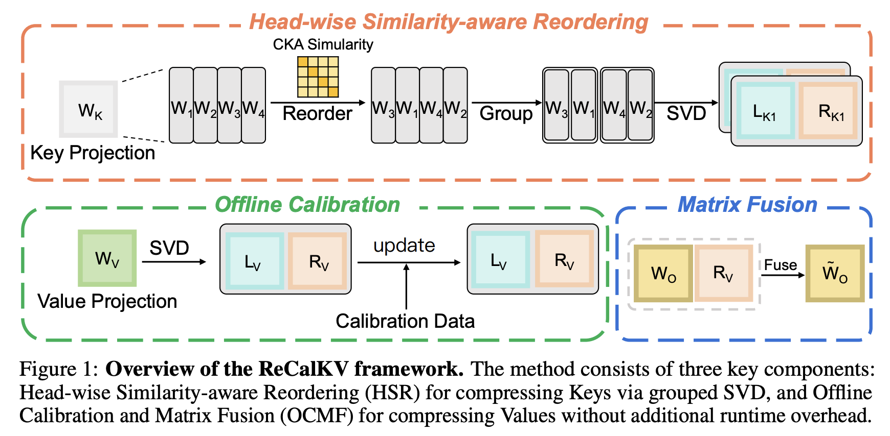
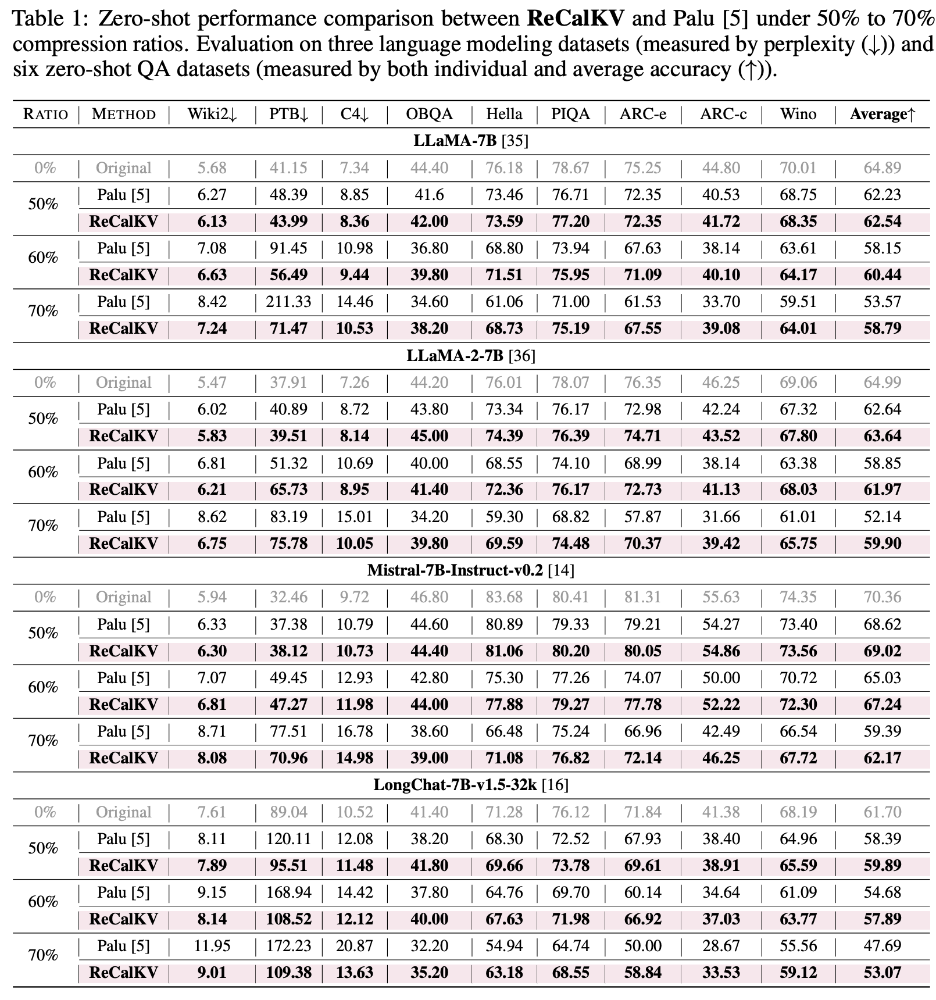
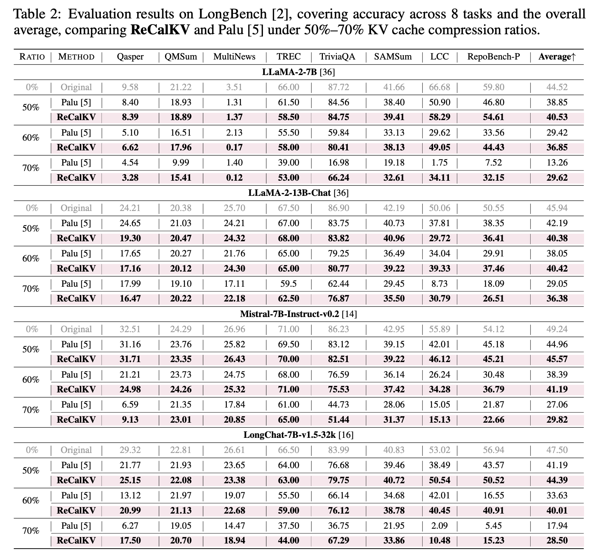

# ReCalKV: Low-Rank KV Cache Compression via Head Reordering and Offline Calibration

Xianglong Yan, [Zhiteng Li](https://zhitengli.github.io), Tianao Zhang, [Linghe Kong](https://www.cs.sjtu.edu.cn/~linghe.kong/), [Yulun Zhang](http://yulunzhang.com/), and [Xiaokang Yang](https://english.seiee.sjtu.edu.cn/english/detail/842_802.htm)

[[arXiv](https://arxiv.org/pdf/2505.24357
)]  [models]

#### 🔥🔥🔥 News

- **2025-05-29:** This repo is released.

---  

> **Abstract:** Large language models (LLMs) have achieved remarkable performance, yet their capability on long-context reasoning is often constrained by the excessive memory required to store the Key-Value (KV) cache. This makes KV cache compression an essential step toward enabling efficient long-context reasoning. Recent methods have explored reducing the hidden dimensions of the KV cache, but many introduce additional computation through projection layers or suffer from significant performance degradation under high compression ratios. To address these challenges, we propose ReCalKV, a post-training KV cache compression method that reduces the hidden dimensions of the KV cache. We develop distinct compression strategies for Keys and Values based on their different roles and varying importance in the attention mechanism. For Keys, we propose Head-wise Similarity–aware Reordering (HSR), which clusters similar heads and applies grouped SVD to the key projection matrix, reducing additional computation while preserving accuracy. For Values, we propose Offline Calibration and Matrix Fusion (OCMF) to preserve accuracy without extra computational overhead. Experiments show that ReCalKV outperforms existing low-rank compression methods, achieving high compression ratios with minimal performance loss. The code and models will be available at: https://github.com/XIANGLONGYAN/ReCalKV.




---

## ⚒️ TODO

* [ ] Complete this repository

## 🔗 Contents

- [ ] Models
- [ ] Code
- [x] [Results](#Results)
- [x] [Citation](#Citation)
- [x] [Acknowledgements](#Acknowledgements)

## 🔎 Results

<details>
<summary>ReCalKV achieves superior zero-shot performance under 50%–70% KV cache compression, with low perplexity on language modeling tasks and high accuracy on zero-shot QA benchmarks. (click to expand)</summary>
<p align="center">
  
</p>

</details>

<details>
<summary>ReCalKV achieves strong and consistent performance across all LongBench tasks under 50%–70% KV cache compression, maintaining high accuracy and overall average scores. (click to expand)</summary>

<p align="center">
  
</p>

</details>

## Citation

If you find the code helpful in your research or work, please cite the following paper.

```
@article{yan2025recalkv,
  title={ReCalKV: Low-Rank KV Cache Compression via Head Reordering and Offline Calibration},
  author={Yan, Xianglong and Li, Zhiteng and Zhang, Tianao and Kong, Linghe and Zhang, Yulun and Yang, Xiaokang},
  journal={arXiv preprint arXiv:2505.24357},
  year={2025}
}
```

## 💡 Acknowledgements

This work is released under the Apache 2.0 license.
