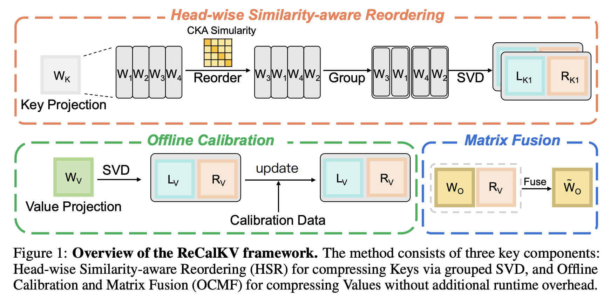
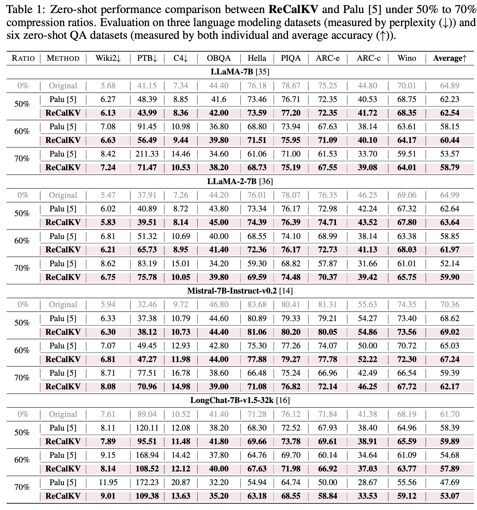
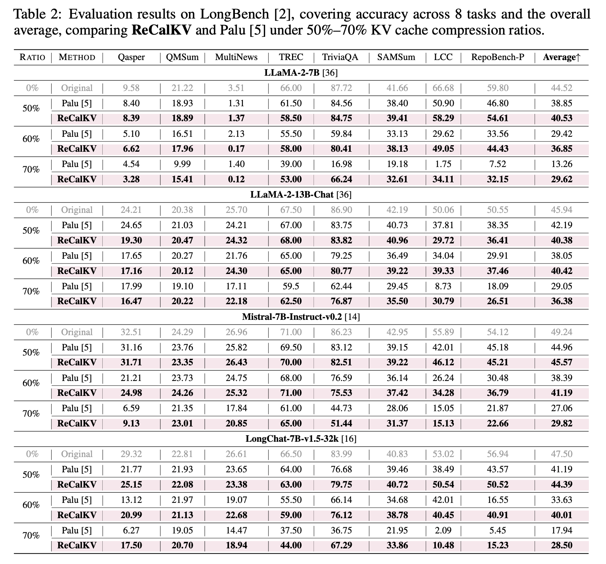

# ReCalKV: Low-Rank KV Cache Compression via Head Reordering and Offline Calibration

<p align="center">
  <a href="https://arxiv.org/abs/2505.24357">
    
  </a>
  <a href="https://github.com/XIANGLONGYAN/ReCalKV">
    
  </a>
  <a href="https://github.com/XIANGLONGYAN/ReCalKV">
    
  </a>
</p>

Xianglong Yan, [Zhiteng Li](https://zhitengli.github.io), Tianao Zhang, [Haotong Qin](https://htqin.github.io/), [Linghe Kong](https://www.cs.sjtu.edu.cn/~linghe.kong/), [Yulun Zhang](http://yulunzhang.com/), and [Xiaokang Yang](https://english.seiee.sjtu.edu.cn/english/detail/842_802.htm)

---

#### 🔥 News

- **2025-05-29:** This repo is released.
- **2025-06-01:** Code is released.

---

> **Abstract:** Large language models (LLMs) have achieved remarkable performance, yet their capability on long-context reasoning is often constrained by the excessive memory required to store the Key-Value (KV) cache. This makes KV cache compression an essential step toward enabling efficient long-context reasoning. Recent methods have explored reducing the hidden dimensions of the KV cache, but many introduce additional computation through projection layers or suffer from significant performance degradation under high compression ratios. To address these challenges, we propose ReCalKV, a post-training KV cache compression method that reduces the hidden dimensions of the KV cache. We develop distinct compression strategies for Keys and Values based on their different roles and varying importance in the attention mechanism. For Keys, we propose Head-wise Similarity–aware Reordering (HSR), which clusters similar heads and applies grouped SVD to the key projection matrix, reducing additional computation while preserving accuracy. For Values, we propose Offline Calibration and Matrix Fusion (OCMF) to preserve accuracy without extra computational overhead. Experiments show that ReCalKV outperforms existing low-rank compression methods, achieving high compression ratios with minimal performance loss. The code and models will be available at: https://github.com/XIANGLONGYAN/ReCalKV.

<p align="center">
  
</p>

---

## 🔗 Contents

- [Installation](#-installation)
- [Data Preparation](#-data-preparation)
- [Usage](#-usage)
- [Code Structure](#-code-structure)
- [Results](#-results)
- [Citation](#citation)
- [Acknowledgements](#-acknowledgements)

## 🔧 Installation

Requires an NVIDIA GPU (reproduced on a single H100-80GB).

```bash
git clone --recurse-submodules https://github.com/XIANGLONGYAN/ReCalKV.git
cd ReCalKV

conda create -n recalkv python=3.10 -y
conda activate recalkv
pip install -r requirements.txt

# lm-evaluation-harness (provides lm-eval, used by run_lm_eval.py)
pip install -e 3rdparty/lm-evaluation-harness

# fast-hadamard-transform: ONLY needed for KV-cache quantization (--lt_hadamard).
# It builds a CUDA extension matching your PyTorch CUDA version.
pip install -e 3rdparty/fast-hadamard-transform
```

> **Note:** `transformers>=4.43` is required (the compression code uses the
> `position_embeddings` decoder API introduced in the 4.43 refactor), and the
> LLaMA/Mistral tokenizers need `sentencepiece`. Both are pinned in
> `requirements.txt`.

## 📚 Data Preparation

Calibration/evaluation datasets are loaded from `$RECALKV_DATA_ROOT`
(default `./data`). Download them once:

```bash
# Optional HF mirror: export HF_ENDPOINT=https://hf-mirror.com
python prepare_data.py --data_root ./data --datasets wikitext,ptb,c4
```

## 🚀 Usage

`runcode.sh` contains a full end-to-end example. The main steps:

### 1. Compress (HSR + OCMF)

```bash
CUDA_VISIBLE_DEVICES=0 python compress.py \
    --model_id /path/to/Llama-2-7b-hf \
    --calib_dataset wikitext2 \
    --decompose_method ours \
    --search_method fisher_uniform \
    --param_ratio_target 0.5 \
    --head_group_size 4 \
    --calib_nsamples 256 \
    --updating_nsamples 256 \
    --updating_dataset wikitext2 \
    --dump_huggingface_model \
    --use_cache
```

`--param_ratio_target` is the target KV-cache compression ratio (e.g. `0.5`,
`0.6`, `0.7`). The compressed model is written to `output_model/`.

`--decompose_method` selects the variant: `ours` (ReCalKV, HSR + OCMF),
`ours_reorder` (HSR only), `ours_calib` (value calibration only),
`ours_baseline` (neither), or `whiten` (Palu baseline).

### 2. Perplexity

```bash
CUDA_VISIBLE_DEVICES=0 python run_ppl_eval.py \
    --model_name_or_path output_model/<compressed_model> \
    --datasets wikitext2,ptb,c4 --seqlen 2048
```

Add `--lt_bits 3 --lt_hadamard` to evaluate with 3-bit low-rank-aware KV quantization.

### 3. Zero-shot accuracy

```bash
CUDA_VISIBLE_DEVICES=0 python run_lm_eval.py \
    --model_name_or_path output_model/<compressed_model> \
    --tasks "openbookqa,hellaswag,piqa,arc_easy,arc_challenge,winogrande"
```

### 4. LongBench

```bash
CUDA_VISIBLE_DEVICES=0 python run_long_bench.py \
    --model_name_or_path output_model/<compressed_model> \
    --datasets "triviaqa,qasper,trec,samsum,lcc,repobench-p,qmsum,multi_news"
```

Pass `--flash2` to enable FlashAttention-2 for much faster generation.

## 📂 Code Structure

| Component | Location |
| --- | --- |
| Pipeline entry point | `compress.py` |
| Fisher-guided rank allocation | `palu/rank_search.py` |
| ReCalKV compression (HSR + value calibration) | `palu/decomposition.py` (`compress_model_ours`) |
| HSR: CKA head reorder + grouped SVD | `palu/model/modules/svd_linear.py` (`from_linear_whiten_reorder`) |
| Value calibration | `palu/model/modules/svd_linear.py` (`from_linear_adasvd`) |
| Fused Triton attention kernel | `kernel/` |

## 🔎 Results

ReCalKV achieves superior zero-shot performance under 50%–70% KV cache compression, with low perplexity on language modeling tasks and high accuracy on zero-shot QA benchmarks.

<p align="center">
  
</p>

ReCalKV achieves strong and consistent performance across all LongBench tasks under 50%–70% KV cache compression, maintaining high accuracy and overall average scores.

<p align="center">
  
</p>

## Citation

If you find the code helpful in your research or work, please cite the following paper.

```bibtex
@article{yan2025recalkv,
  title={ReCalKV: Low-Rank KV Cache Compression via Head Reordering and Offline Calibration},
  author={Yan, Xianglong and Li, Zhiteng and Zhang, Tianao and Kong, Linghe and Zhang, Yulun and Yang, Xiaokang},
  journal={arXiv preprint arXiv:2505.24357},
  year={2025}
}
```

## 💡 Acknowledgements

This work is released under the Apache 2.0 license. The code is built upon
[Palu](https://github.com/shadowpa0327/Palu), and also benefits from
[SVD-LLM](https://github.com/AIoT-MLSys-Lab/SVD-LLM) and
[lm-evaluation-harness](https://github.com/EleutherAI/lm-evaluation-harness).
